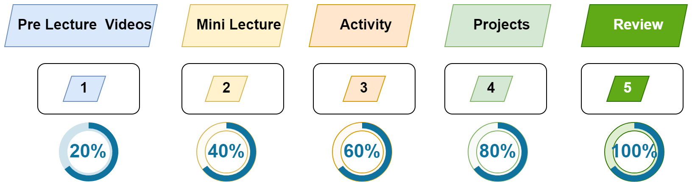

# Session 3: MVC & Middleware

> [!IMPORTANT]  
> - [Homework before Session 4](./material/Homework.md)
> - [Zoom Recordings](https://metropoliafi-my.sharepoint.com/:f:/g/personal/samiben_metropolia_fi/EramjTltA_BOni_R40opXRQBTQ1_gK6EWP2cbcX5G63ghA)

------

### How You'll Learn in This Course

We'll follow a 5-step learning cycle as shown in the figure below:

 
-----
### Session Timeline 

- Morning:
  - Mini lecture (~35min)
  - `Break` (~15min)
  - Pair programming (~35min)
  - Pair programming (~35min)
- Lunch Break - 12:00 -13:00
- Afternoon
  - Mini lecture (~35min)
  - `Break` (~15min)
  - Group Activity (~35min)
  - Mini lecture (~35min)
  - Group Activity (~35min)

-----
### Topics

- Model-View-Controller
- Middleware

-----
###  Morning: Pair Programming

- During the pair programming session, each team will create and test two APIs using Postman. We will also review "npm scripts" with examples such as `npm start`, `npm run dev` and `npm run watch` .
  - [Summary of npm scripts](./material/npm-scripts.md)
  - [Pair Programming Session, Part 1](./material/be-pair-prog1.md)
  - [Pair Programming Session, Part 2](./material/be-pair-prog2.md)
  
> I strongly recommend completing the pair activity today. I'll keep the breakout rooms open for you.

-----

### Afternoon

- Submissions & [*Self Assessment*](./material/self-assesment.xlsx) 
- ~~Draw.io~~
- We'll explore **middleware** and the **Model-View-Controller** (MVC) pattern for our APIs.  
  - [Review of the spread operator](./material/spread.md)
  - *Model-View-Controller* + *Router*
    - [Summary](./material/be-mvc.md), 
    - [Activity 1](./material/be-mvc-activity.md)
    - MVC in action: [Example 1](https://github.com/bradtraversy/proshop-v2), [Example 2](https://github.com/john-smilga/mern-course-jobify)
  - Middleware
    - [Summary](./material/be-middleware.md)
    - [Activity 2](./material/be-middleware-activity.md)

----

Links used in the Lecture

- https://excalidraw.com/
- 

  

<!-- links -->

<!-- 

> [!NOTE]  
> Highlights information that users should take into account, even when skimming.

> [!TIP]
> Optional information to help a user be more successful.

> [!IMPORTANT]  
> Crucial information necessary for users to succeed.

> [!WARNING]  
> Critical content demanding immediate user attention due to potential risks.

> [!CAUTION]
> Negative potential consequences of an action. 

-->